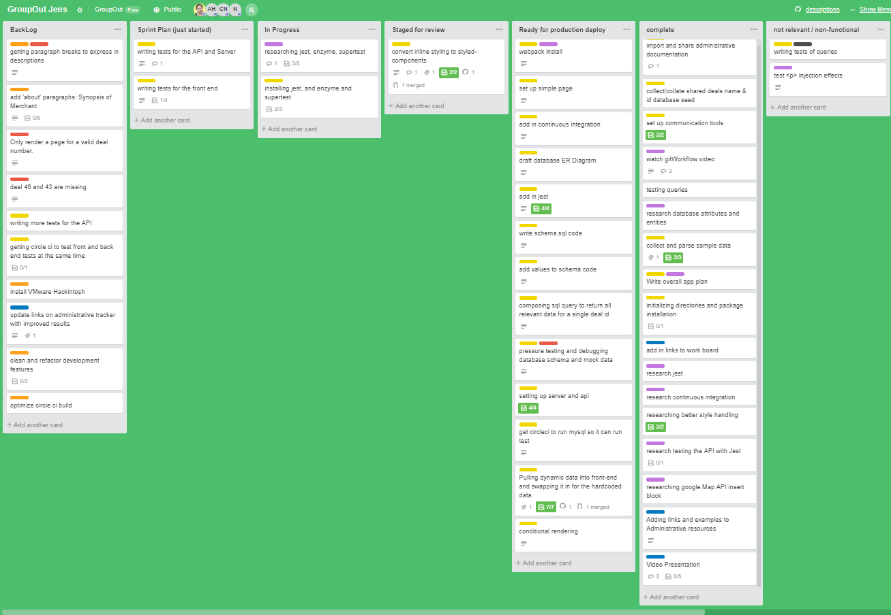

# Project Name

> Presents product descriptions using a RESTful API
> on a Node Express server querying a MySQL database.

## Related Projects

- https://github.com/GroupOut/GroupOutJensProxy
- https://github.com/GroupOut/deal-info
- https://github.com/GroupOut/gallery
- https://github.com/GroupOut/reviews

## Table of Contents

1.  [Usage](#Usage)
1.  [Requirements](#requirements)
1.  [Development](#development)

## Usage

> Install MySQL
> 5.7 is preferred for allowing null password services.
> 8.0 is possible after modifications made for altering the `my_sql_native_password` as per [here](https://github.com/mysqljs/mysql/issues/1507).

## Requirements

An `nvmrc` file is included if using [nvm](https://github.com/creationix/nvm).

- Node 6.13.0
- etc

## Development

### Installing Dependencies

From within the root directory:

```sh
npm install -g webpack
npm install
```

## Database Schema

;

## Current Screenshot


## Current Test Coverage


## Circle CI Build Status


## Sample Development Workspace


